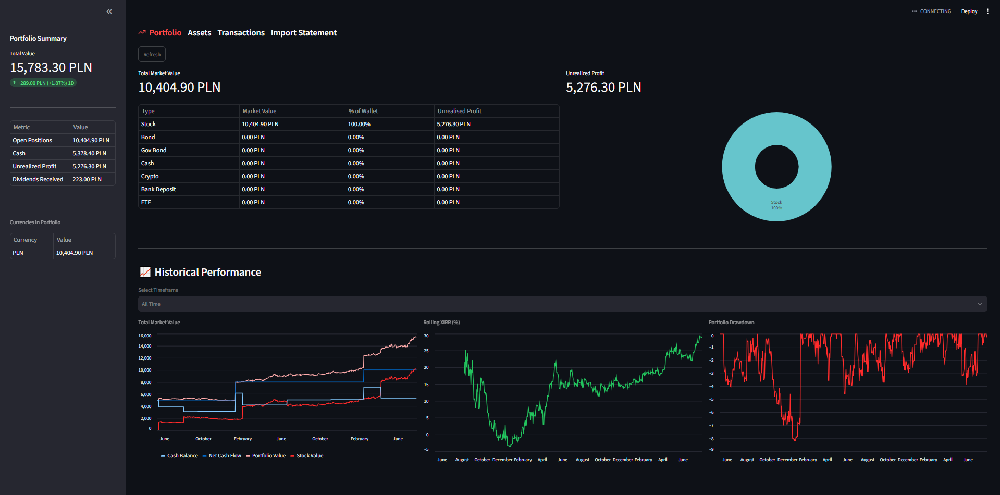

# 📈 Financial Portfolio Tracker

A self-hosted, full-stack financial portfolio dashboard built with **Streamlit**, **SQLModel (SQLite)**, **yFinance**, and **Plotly**. Track open positions, cash balances, historical market performance, rolling XIRR returns, and import trade statements directly from brokers like XTB.



---

## Features

* **Dynamic Portfolio Dashboard**:
  * Real-time portfolio valuation and 1-day percentage delta tracking.
  * Asset allocation breakdown with interactive Plotly donut charts.
  * Historical timeframes (*1M, 3M, 6M, 1Y, 5Y, YTD, All Time*) with total market value line charts.
  * **Rolling XIRR (%)** return calculations and **Portfolio Drawdown (%)** tracking.
* **Broker Statement Importer**:
  * Native parser for **XTB Cash Operation History** (`.xlsx` files).
  * Automatically maps ticker formats (e.g., `.PL` to `.WA` for Warsaw Stock Exchange) and categorizes purchases, sales, dividends, withholding tax, deposits, and withdrawals.
* **Asset & Transaction Management**:
  * Track stocks, ETFs, cash, bank deposits *(TBD: bonds, government bonds, crypto)*.
  * Built-in modal dialogs for manually adding new assets and recording transactions.
  * Styled gain/loss data tables highlighting unrealized profits and daily changes in soft green/red.

---

## Project Structure

```text
├── app.py                      # Main Streamlit application and tab UI
├── database/
│   ├── connection.py           # SQLite database engine initialization
│   └── tables.py               # SQLModel tables (Asset, Transactions, PriceHistory)
├── core/
│   ├── portfolio_engine.py     # Position calculations, history, and XIRR analytics
│   ├── price_fetcher.py        # yFinance integration for current & historical prices
│   └── borker_parser.py        # XTB Excel statement parsing engine
└── portfolio.db                # SQLite database (auto-generated on first run)
```

---

## Getting Started

### 1. Prerequisites

Ensure you have **Python 3.9+** installed on your system.

### 2. Installation

Clone the repository and install the required dependencies:

```bash
git clone https://github.com/pitm779/financial-portfolio.git
cd financial-portfolio

pip install -r requirements.txt
```

### 3. Running the App

Start the Streamlit dashboard:

```bash
streamlit run app.py
```

The database (`portfolio.db`) will automatically initialize on launch.

---

## How to Use

1. **Import XTB Statement**:
* Navigate to the **Import Statement** tab.
* Select **XTB** and upload your exported `.xlsx` Cash Operation History file.
* Preview parsed trades and click **Confirm & Save to Portfolio**.


2. **Add Assets & Transactions Manually**:
* Go to the **Assets** or **Transactions** tab and click the **Add Asset** / **Add Transaction** button to open the input modal.


3. **Analyze Performance**:
* Switch to the **Portfolio** tab to view asset allocation pie charts, rolling XIRR performance, and portfolio drawdown charts over selected time horizons.


---

## License

This project is licensed under the MIT License.
